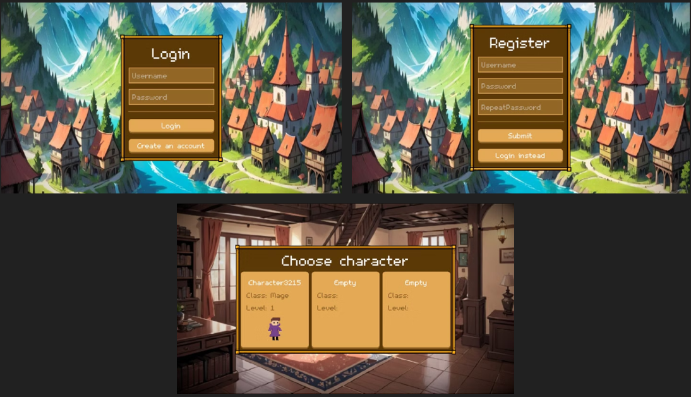
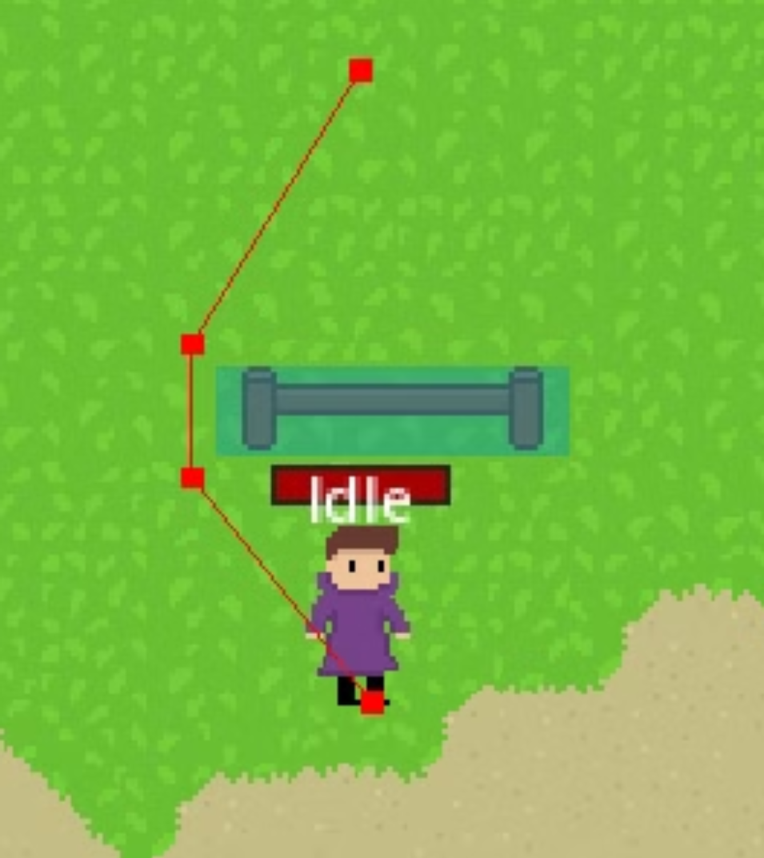
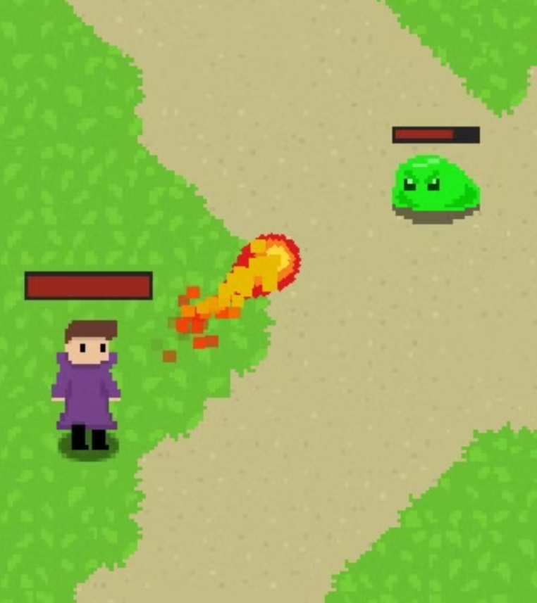

# 2D MMORPG Game

---

## Overview

This is a network-based 2D MMORPG developed using **Godot 4** and **.NET**, focused on multiplayer gameplay, character progression, and persistent world interaction.

Players can explore a shared world, develop their characters, gain experience, and collect items while interacting with other players in real time.

The project is built with a distributed server architecture designed for scalability and separation of concerns.

---

## Features

- Online multiplayer 2D world
- Character progression system (XP and leveling)
- Item collection system
- Real-time combat system
- Pathfinding-based movement
- Persistent game state
- Scalable multi-server architecture

---

## Server Architecture

### Clients

Game clients connect to the gateway server, which routes them to the appropriate game world server.

### Gateway Server

Responsible for:

- connection handling
- authentication routing
- directing clients to game servers

### Game Servers

Each game server represents a single game world and is responsible for:

- world state management
- combat logic
- player synchronization
- gameplay simulation

### Authorization Server

Handles:

- user login verification
- authentication and session validation
- management of available game servers

---

## Tech Stack

- Godot 4 (client)
- .NET (server-side logic)
- Riptide Networking (real-time communication)
- MongoDB (persistent storage)

---

## Screenshots

### Login Interface

User authentication and login system for accessing the game.

---

### Pathfinding System

Demonstration of AI-driven movement and navigation within the game world.

---

### Combat System

Real-time combat mechanics between players and/or enemies.

---

## Installation

Follow platform-specific instructions for running:

- Godot client project
- .NET server infrastructure

---

## Project Purpose

This project was developed as a portfolio piece to demonstrate:

- Multiplayer game architecture design
- Real-time networking systems (Riptide)
- Client-server separation of concerns
- Scalable distributed backend design
- Game development using Godot 4
- Backend systems built with .NET and MongoDB

---

## License

Portfolio / educational project.
